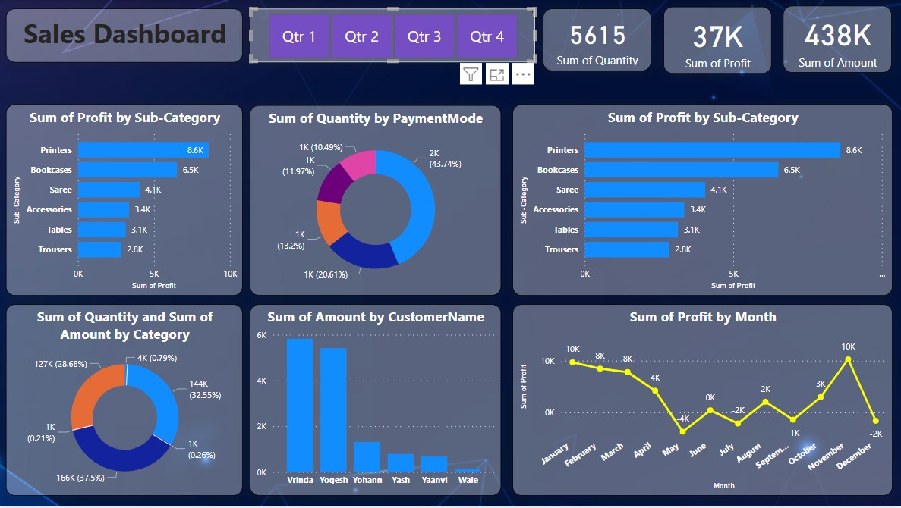

# Sales Dashboard

The following dashboard presents various metrics and key performance indicators relevant to sales data. It has been created using Power BI to provide actionable insights through visual analytics.

## Data Sources

This dashboard was constructed using data from two key files:

- `Orders.csv`: Contains detailed records of sales orders, including quantities, item categories, and profits.
- `Details.csv`: Provides additional information on each order, including customer names and payment methods.

## Sections of the Dashboard

1. **Sum of Profit by Sub-Category**: This chart displays the profit for each sub-category of products based on `Orders.csv`.

2. **Sum of Quantity by Payment Mode**: A pie chart representation of the quantity sold, categorized by payment methods from `Details.csv`.

3. **Key Metrics**: Quick glance numbers at the top show the sum of quantity, profit, and amount derived from both data sources.

4. **Sum of Quantity and Sum of Amount by Category**: A donut chart showing the distribution of quantity and amount by category, integrating data from both CSV files.

5. **Sum of Amount by Customer Name**: A bar graph presenting the amount spent by each customer, as listed in `Details.csv`.

6. **Sum of Profit by Month**: A line graph depicting the profit trend over the year, calculated from monthly data in `Orders.csv`.

## Analysis

The dashboard provides a comprehensive view of sales performance across multiple dimensions. By analyzing the trends and patterns, stakeholders can make informed decisions to drive business growth.

Remember to replace `/path/to/image.png` with the actual path to your dashboard image.

